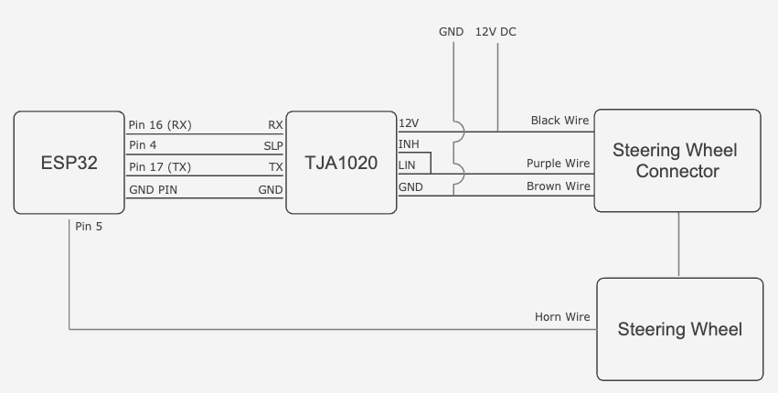

# Volkswagen Steering Wheel Gamepad 🎮

English | [Português](./README-pt.md)

This open-source project allows you to repurpose a Volkswagen steering wheel with LIN bus communication as a versatile gamepad for PC sim racing games or other applications. By reverse engineering the steering wheel's LIN bus protocol, this project reads button presses, and transmits them as gamepad events over Bluetooth Low Energy (BLE). It also provides full control over the steering wheel's button backlights, ensuring complete functionality. This opens up new possibilities for controlling games and applications with an authentic and immersive input device.

**Note:** This project focuses on utilizing the steering wheel buttons as an input device. It does not provide analog steering wheel angle information or handle force feedback, as those functions are typically handled by a dedicated wheel base for sim racing.

This project can also serve as a foundation for adapting incompatible steering wheels in other vehicles, providing a starting point for custom solutions and expanding compatibility.

## Features

*   **Steering Wheel Integration**
    *   Reads button states from Volkswagen steering wheels with LIN bus communication, including models from VW, Audi, Skoda, and Seat with PQ24/PQ25 platforms (tested with a VW Up! steering wheel, compatibility with other models is likely but not guaranteed).
    *   Supports dedicated horn button for in-game actions.
*   **Bluetooth Capabilities**
    *   Transmits button presses wirelessly as a standard Bluetooth gamepad, compatible with PCs and other Bluetooth-enabled devices.
    *   Utilizes Bluetooth Low Energy (BLE) for efficient power consumption.
*   **Backlight Control**
    *   Provides 128 levels of brightness control for the steering wheel buttons' backlight.
*   **Reusable Components**
    *   Modular design with well-defined components for easy integration into other projects or customization.

## How It Works

This project utilizes the LIN bus, a communication network in vehicles, to read button presses from the steering wheel. The ESP32 microcontroller acts as the master node on the LIN bus, requesting and receiving data from the steering wheel (the slave node).

1.  **Button Press:** When you press a button on the steering wheel, the steering wheel module sends a data packet over the LIN bus.
2.  **ESP32 Reads Data:** The ESP32, connected to the LIN bus via the LIN transceiver, receives and decodes this data packet.
3.  **BLE Transmission:** The ESP32 translates the button press into a standard gamepad event and transmits it over BLE.
4.  **Game Action:** The receiving device (e.g., PC) recognizes the gamepad event and triggers the corresponding action in the game or application.

## Parts Used

| Part                    | Description                                                                     | Part Number |
|-------------------------|---------------------------------------------------------------------------------|-------------|
| Steering Wheel Connector | 5-pin connector for the steering wheel (only 3 pins are used in this project) | 8E0 973 605 |
| Steering Wheel          | VW Up! steering wheel with buttons and without paddles                            | 6EA 419 091 H |
| Steering Wheel Commands | The electronic module within the steering wheel that handles button presses     | 18D 959 442 |
| LIN Transceiver         | TJA1020, TJA1021, or SIT1021T ([I used this one from AliExpress](https://pt.aliexpress.com/item/1005006348508612.html))                                                 | -            |
| ESP32                   | Any ESP32 development board                                    | -            |

## Wiring Diagram
Please note that the wiring diagram is based on my specific setup. The wiring may be different depending on the steering wheel model or MCU board used.

## LIN Protocol

The steering wheel communicates using LIN frames. Here's a breakdown of the relevant frames, obtained through reverse engineering:

| Frame ID | Type             | Description                          | Size | Byte 0                                     | Byte 1                                 | Byte 5                                         |
|----------|------------------|--------------------------------------|------|------------------------------------------|-----------------------------------------|-------------------------------------------------|
| 0x0D     | Master Request  | Set backlight level                  | 2    | 0x0 - 0x7F - Brightness level           | 0xFF - Enables/disables button state responses | -                                                |
| 0x0E     | Slave Response | Button states                        | 8    | Increases on every response             | Button pressed (see mapping table below) | Indicates how long the button has been held     |
| 0x0C     | Slave Response | Unknown (possibly diagnostics data) | 4    | Increases on every response             | -                                        | -                                                |
| 0x3A     | Slave Response | Unknown (possibly diagnostics data) | 2    | Increases on every response             | -                                        | -                                                |

**Button Mapping**

(TODO)

| ID   | Button          |
|------|-----------------|
| 0x02 | -       |
| 0x03 | -     |
| 0x06 | -      |
| 0x07 | -  |
| 0x09 | -    |
| 0x0A | -  |
| 0x1A | -   |
| 0x22 | Up              |
| 0x23 | Down            |
| 0x28 | -       |
| 0x2A | -            |
| 0x2B |-            |

## Planned Features
- [ ] Customizable backlight brightness levels via button combinations
- [ ] Backlight control via BLE, allowing manual adjustment on connected devices or automatic changes based on game events, such as headlight activation
- [ ] Airbag deployment based on in-game collisions for added immersion
